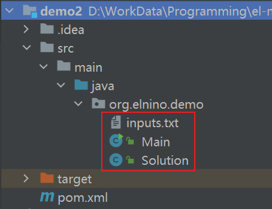
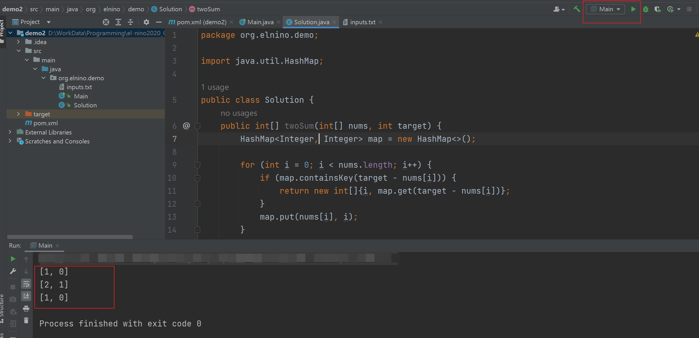

# Coding Contest Helper
LeetCode 刷题助手：旨在提供一个与 LeetCode 类似的核心代码模式的刷题环境。具体来说，我们只需关注编写核心的算法逻辑，而用例（参数）的传入依靠该包下的工具类自动完成。

这个框架/工具免除了我们在代码中手写输入参数的麻烦，实现了外部文件批量传入测试用例。对于不同的题目，已有的测试逻辑可以复用。

# 安装步骤

1. 下载到本地

2. 打包安装：

    ```sh
    mvn install -DskipTests
    ```

# Quick Start

这里以[力扣的『两数之和』](https://leetcode.com/problems/two-sum/)为例，展示如何使用该框架：

创建一个 Maven 工程，包含如下依赖：

```xml
<dependency>
		<groupId>org.elnino</groupId>
    <artifactId>coding-contest-helper</artifactId>
    <version>0.0.1-SNAPSHOT</version>
</dependency>
```

本示例需要用到 3 个 文件：



1️⃣inputs.txt 放参数：

```json
[2,7,11,15]
9
[3,2,4]
6
[3,3]
6
```

2️⃣Solution.java 放题解：（力扣上绝大部分的题都是这个类）

```java
package org.elnino.demo;

import java.util.HashMap;

public class Solution {
    public int[] twoSum(int[] nums, int target) {
        HashMap<Integer, Integer> map = new HashMap<>();

        for (int i = 0; i < nums.length; i++) {
            if (map.containsKey(target - nums[i])) {
                return new int[]{i, map.get(target - nums[i])};
            }
            map.put(nums[i], i);
        }
        return null;
    }
}

```

3️⃣Main.java 中使用该框架：

```java
package org.elnino.demo;

import org.elnino.helper.contest.coding.leetcode.utils.IOUtils;
import org.elnino.helper.contest.coding.leetcode.utils.SolutionUtils;

import java.lang.reflect.InvocationTargetException;

public class Main {
    public static void main(String[] args) throws InvocationTargetException, IllegalAccessException {
        String path = "src/main/java/org/elnino/demo/inputs.txt";
        String[] lines = IOUtils.readAllLines(path);
        SolutionUtils.solve(new Solution(), lines);
    }
}

```

4️⃣运行 Main，查看结果：



